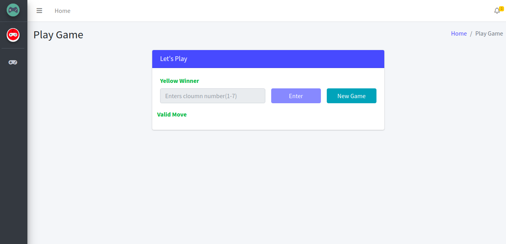

# Game 4 in A line




---

## Table of Contents 

- [Getting Started](#getting-started)
- [Prerequisites](#prerequisites)
- [Installation](#installation)
- [Support](#support)
- [License](#license)


---
## Game Overview

Connect Four is a two-player connection board game. Player take turns by selecting column from  6*7 grid. The pieces fall straight down, occupying the lowest available space within the column. The objective of the game is to be the first to form a horizontal, vertical, or diagonal line of four of one's own color. Connect Four is a solved game. The first player can always win by playing the right moves.

### Prerequisites

What things you need to install the software and how to install them
- Node JS v8.0.0+
- MongoDB v3.6+
- npm v6.4.1+
## Installation
```shell
$ git clone https://github.com/Riddhish97/4-In-A-Line.git
$ npm install
```
> Create file from sample file

- Create .env file from sample and set port
- Create databse.js file from database.sample.js

Note - Default port for mongoDB is 27017 if you have mongoDb running on different port please update it in database.js
> Run this below command which will create user in mongoDB and store data in your DB
```shell
$ node scripts/initScripts.js 
```
> Run the project
```shell
$ node bin/www
```
`Note - If you have docker and docker-compose install in your PC then run only the below command to start project`

```shell
$ docker-compose up -d --build 
```
Project will start on `3006` port. You can update port in `docker-compose.yml` for project and mongoDB in case of docker.

---

## Support

Reach out to me at one of the following places!

- Email at <a href="mailto:riddhishraj@gmail.com" target="_blank">`riddhishraj@gmail.com`</a>
- Twitter at <a href="http://twitter.com/mr_rajgor1997" target="_blank">`@mr_rajgor1997`</a>

---

## License

- **[MIT license](http://opensource.org/licenses/mit-license.php)**
