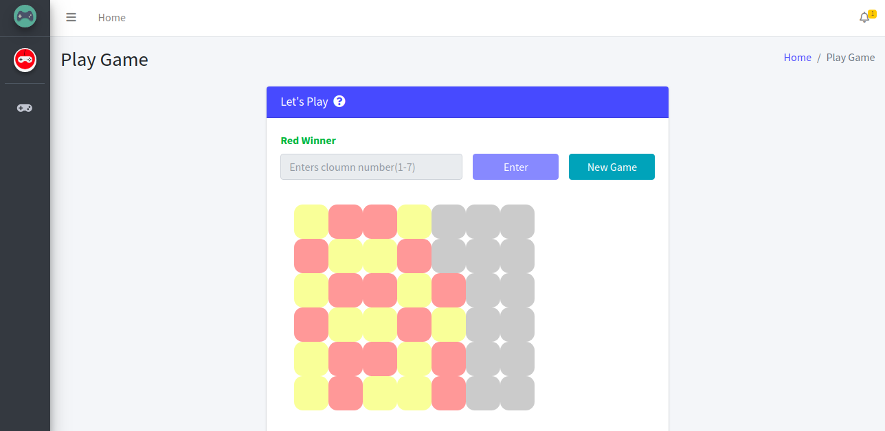

# Game 4 in A line




---

## Table of Contents (Optional)

- [Getting Started](#getting-started)
- [Prerequisites](#prerequisites)
- [Installation](#installation)
- [Support](#support)
- [License](#license)


---
## Getting Started

These instructions will get you a copy of the project up and running on your local machine for development and testing purposes.

### Prerequisites

What things you need to install the software and how to install them
- Node JS v8.0.0+
- MongoDB v3.6+
- npm v6.4.1+
## Installation
```shell
$ Unzip project
$ npm install
```

Note - Default port for mongoDB is 27017 if you have mongoDb running on different port please update it in database.js
> Run this below command which will create user in mongoDB and store data in your DB
```shell
$ node scripts/initScripts.js 
```
> Run the project
```shell
$ node bin/www
```
`Note - If you have docker and docker-compose install in your PC then run only the below command to start project`

```shell
$ docker-compose up -d --build 
```
Project will start on `3006` port. You can update port in `docker-compose.yml` for project and mongoDB in case of docker.

---

## Support

Reach out to me at one of the following places!

- Email at <a href="mailto:riddhishraj@gmail.com" target="_blank">`riddhishraj@gmail.com`</a>
- Twitter at <a href="http://twitter.com/mr_rajgor1997" target="_blank">`@mr_rajgor1997`</a>

---

## License

- **[MIT license](http://opensource.org/licenses/mit-license.php)**
